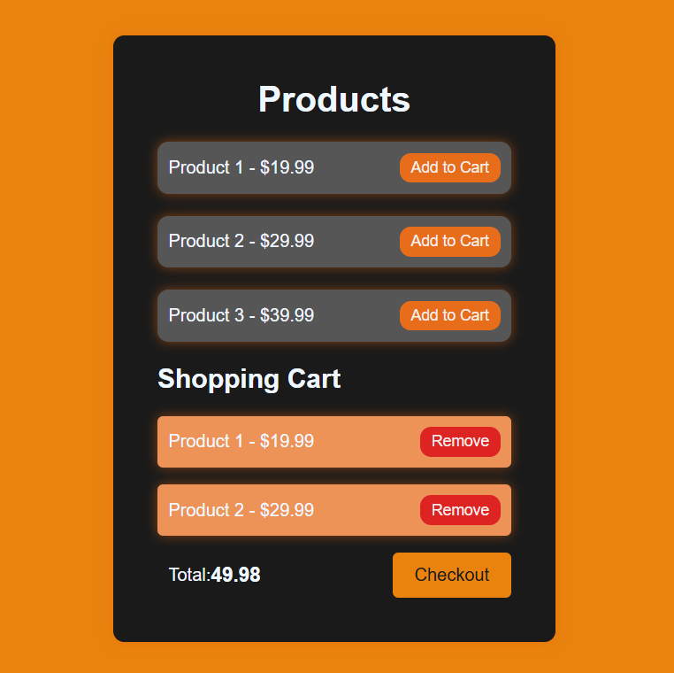

# 💼 Shopping Cart Web App

A simple and responsive Shopping Cart web application built using **HTML**, **CSS**, and **JavaScript**. Users can add products to their cart, view the total price, remove items, and checkout.

---

## 🚀 Features

- 📟 Add and remove products to/from cart
- 💰 Real-time total price calculation
- 🧼 Checkout to clear cart
- 📂 LocalStorage support (cart persists on page reload)
- 🎨 Stylish and responsive UI

---

## 🛠️ Tech Stack

- **HTML** – Page structure
- **CSS** – Styling and layout
- **JavaScript** – Logic and interactivity

---

## 📸 Preview



---

## 📂 File Structure

```
├── index.html       # Main HTML structure
├── style.css        # All custom styling
└── script.js        # App logic and interactivity
```

---

## 📦 How to Run

1. Clone the repository:
   ```bash
   git clone https://github.com/your-username/shopping-cart.git
   cd shopping-cart
   ```
2. Open `index.html` in your browser.

---

